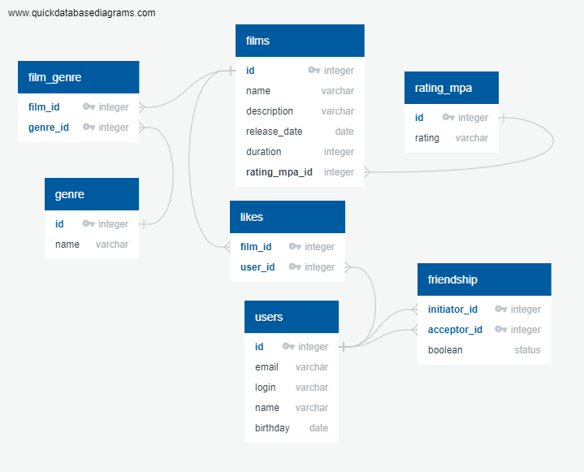

# java-filmorate
Template repository for Filmorate project.



<details>

<summary>
Примеры запросов к БД
</summary>

- Получить список всех фильмов
``` sql
SELECT * FROM FILMS;
```

- Получить фильм по id
``` sql
SELECT * FROM FILMS
WHERE ID = <film_id>;
```

- Получить список всех пользователей
``` sql
SELECT * FROM USERS;
```

- Получить пользователя по Id
``` sql
SELECT * FROM USERS
WHERE ID = <user_id>;
```

- 10 Самых популярных фильмов
``` sql
SELECT FILMS.NAME, COUNT(LIKES.USER_ID)
FROM FILMS
LEFT JOIN LIKES ON
FILMS.ID = LIKES.FILM_ID
GROUP BY FILMS.ID
ORDER BY COUNT(LIKES.USER_ID) DESC
LIMIT 10;
```

- Получить список id пользователей, которые лайкнули пост
``` sql
SELECT LIKES.USER_ID
FROM LIKES
JOIN FILMS
ON FILMS.ID = LIKES.FILM_ID
WHERE FILMS.ID = <film_id>
```

- Получить список друзей пользователя
``` sql
-- Ищем друзей, где пользователь инициатор
SELECT USERS.* FROM FRIENDSHIP
JOIN USERS ON
USERS.ID = FRIENDSHIP.ACCEPTOR_ID
WHERE FRIENDSHIP.INITIATOR_ID = <user_id>
-- Ищем друзей, где пользователь согласился на дружбу
UNION
SELECT USERS.* FROM FRIENDSHIP
JOIN USERS ON
USERS.ID = FRIENDSHIP.INITIATOR_ID
WHERE FRIENDSHIP.ACCEPTOR_ID = <user_id> AND FRIENDSHIP.STATUS = TRUE 
```
</details>